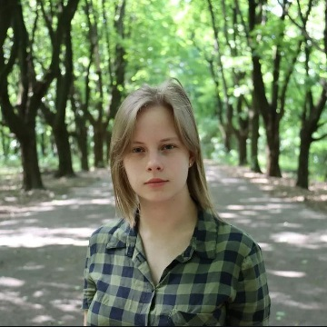

# Shyrshova Maryna

## Contacts
**Phone:** 380-957-602-529

**E-mail:** shyrshovamaryna@gmail.com

**Telegram:** @gingers_hut

**Discord:** shirshovamarina

**Git-Hub:** ReneeShkipper 

***
## My ojectives
Contribute to and collaborate with a cohesive and supportive team. Engage in challenging and interesting tasks that stimulate continuous learning and innovation. Pursue opportunities for professional development to enhance my skills and advance my career.

***
## Experience and Education
*I have completed two college courses majoring in Software Engineering. Throughout my studies, I have gained experience in various programming languages and technologies, including:*

* Pascal and BASIC for foundational programming concepts.
* C++ for object-oriented programming and software development.
* Basic knowledge of C# for application development.
* HTML and CSS for web development basics.

*In addition to this, I am proficient in:*

* I have experience in creating and manipulating one-dimensional and multidimensional and dynamic arrays. 
* Also I am skilled in using various sorting algorithms.
* Using functions and procedures to write modular and reusable code.
* Working with files for data storage and manipulation.
* Implementing various data structures to efficiently manage and organize data.
* Familiar with graphs, as well as their properties. I can identify cycles, adjacency matrices and incidence tables.

*I am eager to leverage this knowledge and continue expanding my expertise in a professional setting.*

***
## Code example
```
function text(x) {
    let i = 0;
    while(i < x){
        console.log('It works!');
        i++;
    }
  }
  text(3);
```

***
Pet project: **Organization of external memory**

The data structure taken from the file is sorted and searched by the field selected by the user.

Study project: **CV**

Development and execution of a document in which the writer describes his education and work experience.

***
## Education
* 2022 - current time: Kharkiv Radio Technical College
* Pre-Junior C# .NET Full-stack course in Epam Systems
* Pre-Junior Java course in Epam Kids

***
## Languages
* Ukrainian - Native
* English - B1